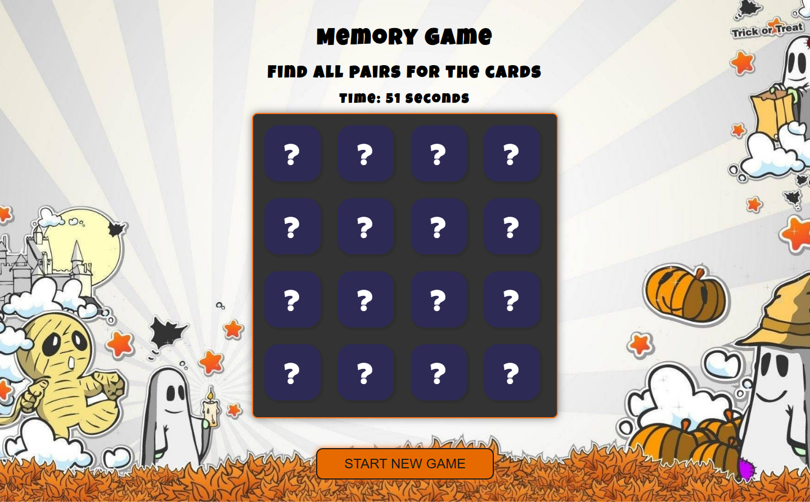
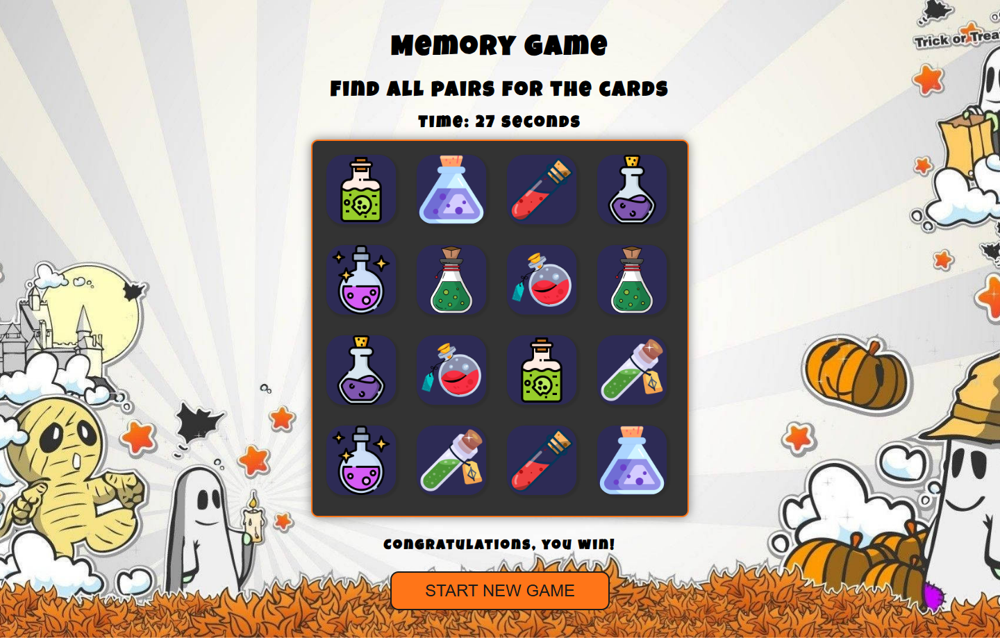

# Memory Game 🎮

**Memory Game** — это классическая игра на запоминание пар карточек, выполненная в тематике Хэллоуина.

## 🚀 Особенности игры

- **Интерактивный игровой процесс**: Играйте с карточками, которые нужно переворачивать и находить совпадающие пары.
- **Оформление в стиле Хэллоуина**: Тематические изображения и дизайн создают атмосферу праздника.
- **Анимации и плавные переходы**: Плавные эффекты и переходы при взаимодействии с карточками.
- **Ограничение по времени**: У игроков есть определенное время на завершение игры.
- **Сообщения о результате**: Отображение сообщения о победе или о том, что время вышло.

## 🛠️ Технологии

- **HTML**: Разметка для структуры игры.
- **CSS**: Стилизация и анимации, в том числе адаптивный дизайн.
- **JavaScript**: Логика игры и взаимодействие с пользователем.

## 🎮 Как играть

1. Нажмите на кнопку «START NEW GAME», чтобы открыть игровое поле.
2. Переворачивайте карточки, чтобы найти совпадающие пары.
3. Игра закончится, если вы найдете все пары до истечения времени.
4. Если время истекло, появится сообщение с предложением попробовать ещё раз.

## 📦 Установка и запуск

1. Склонируйте репозиторий:
    ```bash
    git clone https://github.com/ваш-пользователь/ваш-репозиторий.git
    ```

2. Откройте `index.html` в вашем браузере.

## 🖼️ Примеры игрового интерфейса
<div align="center">
  
  
</div>
